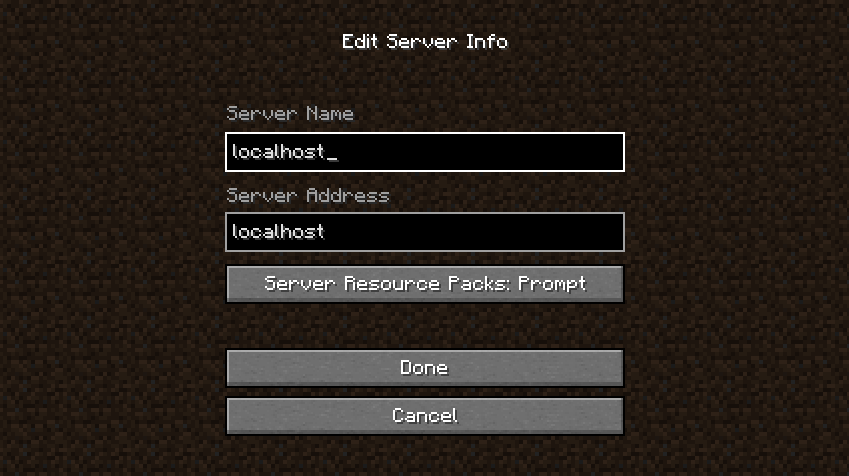

# Development

## Prerequisites

### Java 21

This mod requires Java 21. 


Install JDK 21 directly, or use [SDKMAN](https://sdkman.io/) (macOS/Linux):

```bash
sdk env install
sdk env
```

### Docker

Local server testing requires [Docker](https://www.docker.com/get-started).

### Platform Notes

Commands in this guide use Unix-style syntax (`./gradlew`). On Windows, use `gradlew.bat` instead.

## Quick Start

Full development workflow:

```bash
# Build and install mod, build local server, boot local server
./gradlew clean build localInstallJar localInstallFabricApi localBuildServer localRunServer
```

## Build the Mod

Build the mod JAR:
```bash
./gradlew clean build
```

The output JAR will be in `build/libs/event-notifications-{version}.jar`

Install the mod to your local test server:
```bash
./gradlew clean build
```

## Local Test Server

### Build Local Server

Build the local server Docker image (only needs to be done once, unless you change Minecraft or mod version):

```bash
./gradlew localBuildServer
```

### Run Local Server

Start the local server. Restart the server each time you rebuild the mod to pick up changes:

```bash
./gradlew localRunServer
```

To run with an interactive terminal (for server console input), use Docker directly:

```bash
docker run -it --rm -p 25565:25565 --volume "${PWD}/local/fs/data:/data" event-notification-local
```

### Connect to Local Server

Connect to the local server with the mod installed:



### Sanity Test

Check the server STDOUT to see if a STDOUT notification was emitted.
